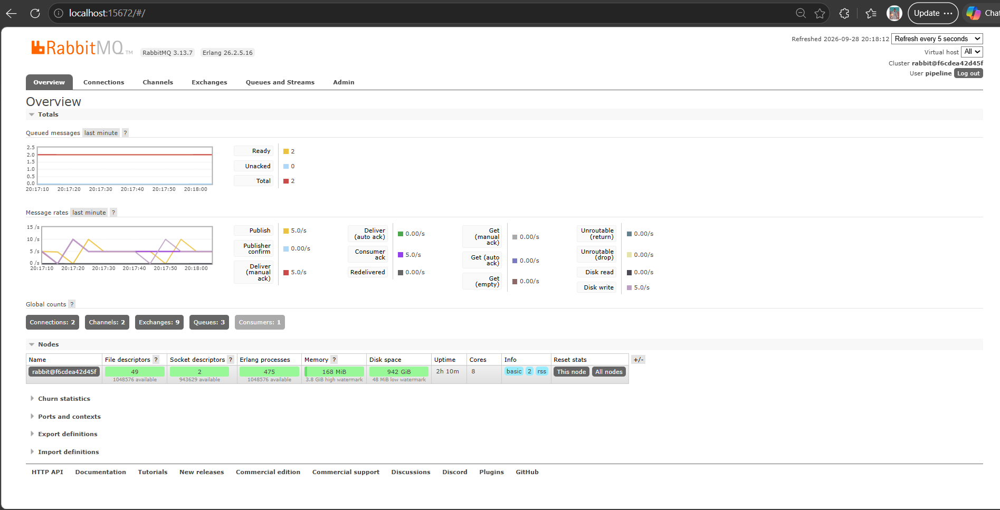
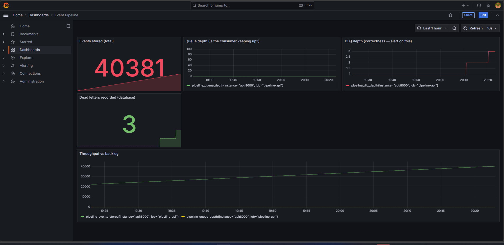
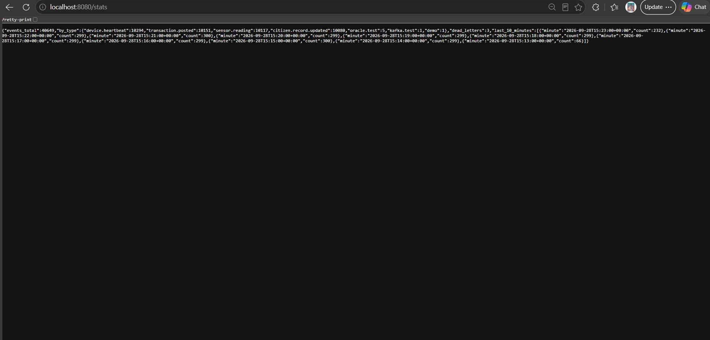
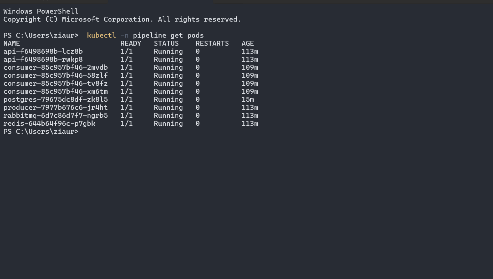
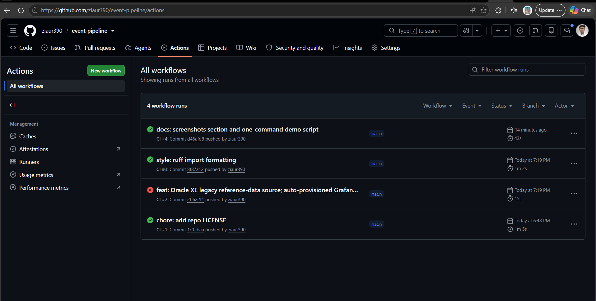

# Event-Driven Data Pipeline

A containerized event pipeline with at-least-once delivery, idempotent processing,
bounded retries, dead-letter handling, and Prometheus monitoring. Runs on Docker
Compose locally and on Kubernetes (kind) in production configuration.


## Architecture

```
                      ┌──────────────┐
                      │   PRODUCER   │  generates events (Python)
                      └──────┬───────┘
                             │ publish
                             ▼
        ┌────────────────────────────────────────┐
        │              RABBITMQ                  │
        │  exchange: events (topic)              │
        │  queue: events.worker                  │
        │  queue: events.retry  (TTL delay)      │
        │  queue: events.dead   (dead letters)   │
        └──────┬───────────────────────┬─────────┘
               │ consume               │ after 3 failed attempts
               ▼                       ▼
        ┌──────────────┐        ┌─────────────┐
        │   CONSUMER   │───────▶│  DEAD LETTER│
        │   (Python)   │        │  QUEUE + DB │
        └──┬────┬───┬──┘        └─────────────┘
   dedup   │    │   │  persist
   ┌───────┘    │   └────────────┐
   ▼            ▼                ▼
┌───────┐  ┌─────────┐    ┌────────────┐
│ REDIS │  │  NGINX  │    │ POSTGRESQL │
│ cache │  │  proxy  │    │   JSONB    │
│ dedup │  └────┬────┘    └────────────┘
└───────┘       ▼
          ┌──────────┐      ┌────────────┐
          │   API    │─────▶│ PROMETHEUS │
          │ FastAPI  │ /metrics + GRAFANA │
          └──────────┘      └────────────┘
```

## Quick start

```bash
./scripts/up.sh
```

| Service | URL |
|---|---|
| API (via Nginx) | http://localhost:8080/health |
| RabbitMQ management | http://localhost:15672 (pipeline/pipeline) |
| Prometheus | http://localhost:9090 |
| Grafana (auto-provisioned dashboard) | http://localhost:3000/d/event-pipeline (admin/admin) |

Kafka variant: `BROKER=kafka docker compose --profile kafka up -d`

Oracle reference data (optional): `docker compose --profile oracle up -d oracle`,
then restart the consumer with `ORACLE_DSN=oracle:1521/XEPDB1`. Device zones are
read from the legacy `reference_devices` table and cached in Redis, so Oracle is
hit at most once per device per cache TTL. If Oracle is down the pipeline falls
back to simulated lookups instead of failing.

Kubernetes: see below.

## Why each component

| Component | Why it is here |
|---|---|
| RabbitMQ | Decouples producer from consumer. Buffers load. Survives consumer crashes via acknowledgement. |
| Dead-letter queue | A malformed message must not block the queue forever. Three attempts, then quarantine. |
| Redis | Atomic deduplication (SET NX) and caching of reference lookups. |
| PostgreSQL | Durable source of truth, with a UNIQUE constraint on event_id as the authoritative idempotency guard. |
| FastAPI + Nginx | Operational interface behind a reverse proxy with rate limiting. |
| Prometheus | Queue depth and DLQ depth. DLQ depth is the correctness metric. |
| Oracle XE (optional) | Legacy reference-data source behind a config flag, cached in Redis. |
| Kubernetes | Same pipeline, scheduled with replicas and proper liveness/readiness probes. Stateful services (Postgres, RabbitMQ, Redis) run as StatefulSets with per-pod volumes. |

## Design decisions

**At-least-once with idempotent consumers.** Exactly-once delivery is not achievable
across a broker and a database without distributed transactions. At-least-once plus
idempotent handlers gives correctness with far less complexity.

**Two layers of idempotency.** Redis `SET NX` is the fast path and skips the work
entirely. The PostgreSQL `UNIQUE` constraint on `event_id` is the authoritative guard
that cannot be evicted or lost. Redis is an optimisation; the database is the truth.

**The dedup key is released on failure.** A subtle bug worth knowing about: if the
event is marked as processed in Redis *before* the handler runs, and the handler then
fails, every retry short-circuits as a "duplicate" and the dead-letter path is
unreachable. The consumer deletes the dedup key on failure so retries re-run the
handler. `tests/test_pipeline.py::test_process_releases_dedup_key_when_handler_fails`
pins this behaviour.

**Retries use a delay queue, not requeue.** `nack(requeue=True)` redelivers
immediately, which turns a poison message into a hot loop. A queue with a TTL and a
dead-letter routing key back to the work queue gives a real delay with no `sleep()`
in application code.

**Separate liveness and readiness endpoints.** `/health` never touches a dependency,
so a database blip cannot cause Kubernetes to restart a healthy container. `/ready`
does check dependencies, so traffic is only sent to pods that can serve it.

**Two brokers behind one interface.** RabbitMQ is a smart broker with dumb consumers:
it tracks acknowledgements, deletes on ack, and has native dead-lettering. Kafka is a
dumb broker with smart consumers: an append-only log with consumer-managed offsets and
retention, so streams can be replayed. The clearest practical difference is failure
handling, since Kafka has no `nack` and requires dead-lettering to be implemented as a
separate topic.

## Failure modes this handles

| Failure | Handling |
|---|---|
| Consumer crashes mid-processing | Message not acknowledged, so it is redelivered on restart |
| Consumer slower than producer | Messages buffer in the queue; queue depth is monitored |
| Malformed event | Three attempts via delay queue, then dead-lettered and recorded in the database |
| Same event delivered twice | Redis `SET NX` skips it; database `UNIQUE` constraint is the backstop |
| Broker restarts | Durable queues and persistent messages survive |
| Dependency down at startup | Every service retries its connections instead of exiting |

## Screenshots

| | |
|---|---|
|  |
|  |
|  |
|  |
|  |

## Running the tests

```bash
pytest -v
ruff check .
```

## Kubernetes (kind)

```bash
kind create cluster --name pipeline
docker build -t event-pipeline-producer:latest ./producer
docker build -t event-pipeline-consumer:latest ./consumer
docker build -t event-pipeline-api:latest ./api
kind load docker-image event-pipeline-producer:latest --name pipeline
kind load docker-image event-pipeline-consumer:latest --name pipeline
kind load docker-image event-pipeline-api:latest --name pipeline
kubectl apply -f k8s/
kubectl -n pipeline get pods
kubectl -n pipeline get statefulset,pvc,svc
kubectl -n pipeline scale deploy/consumer --replicas=4
kubectl -n pipeline rollout status statefulset/postgres
```

### Stateful workloads run as StatefulSets

The three services that hold data use `StatefulSet`, not `Deployment`. That is a
correctness decision, not a style preference.

| Service | Why it cannot be a Deployment |
|---|---|
| **PostgreSQL** | A Deployment mounts one shared `ReadWriteOnce` PVC. Scaling it to two replicas would run two Postgres processes against the same data directory, which is corruption rather than a performance problem. `volumeClaimTemplates` gives each ordinal its own PVC (`data-postgres-0`). |
| **RabbitMQ** | Mnesia, its Erlang database, ties its state to the node name derived from the hostname. A Deployment gives random hostnames, so every restart comes back as a different node and the queues and persistent messages are no longer the ones it knows. `RABBITMQ_NODENAME` is pinned to the stable pod identity. |
| **Redis** | It holds the deduplication keys. A restart without persistence forgets them and already-processed events look new. `--appendonly yes` narrows the window. The PostgreSQL `UNIQUE` constraint remains the authoritative guard, so a flush degrades performance rather than correctness. |

Each has two Services: a **headless** Service (`clusterIP: None`) that the
StatefulSet names in `serviceName` to give each pod a stable DNS record, and an
ordinary **ClusterIP** Service that the application connects to. The ClusterIP
names are unchanged (`postgres`, `rabbitmq`, `redis`), so the ConfigMap URLs still
resolve.

Two settings that are easy to miss:

- **`fsGroup: 999`** - the official Postgres, RabbitMQ and Redis images run as uid
  999. Without `fsGroup`, Kubernetes mounts the volume owned by root and the
  container fails to start with a permission error.
- **`PGDATA=/var/lib/postgresql/data/pgdata`** - a mounted volume root normally
  contains `lost+found`, and `initdb` refuses to initialise a non-empty directory.

Deleting a StatefulSet does **not** delete its PVCs. That is deliberate: an
accidental `kubectl delete statefulset postgres` should not destroy the database.
Remove the volumes explicitly with `kubectl -n pipeline delete pvc data-postgres-0`
if you mean it.
